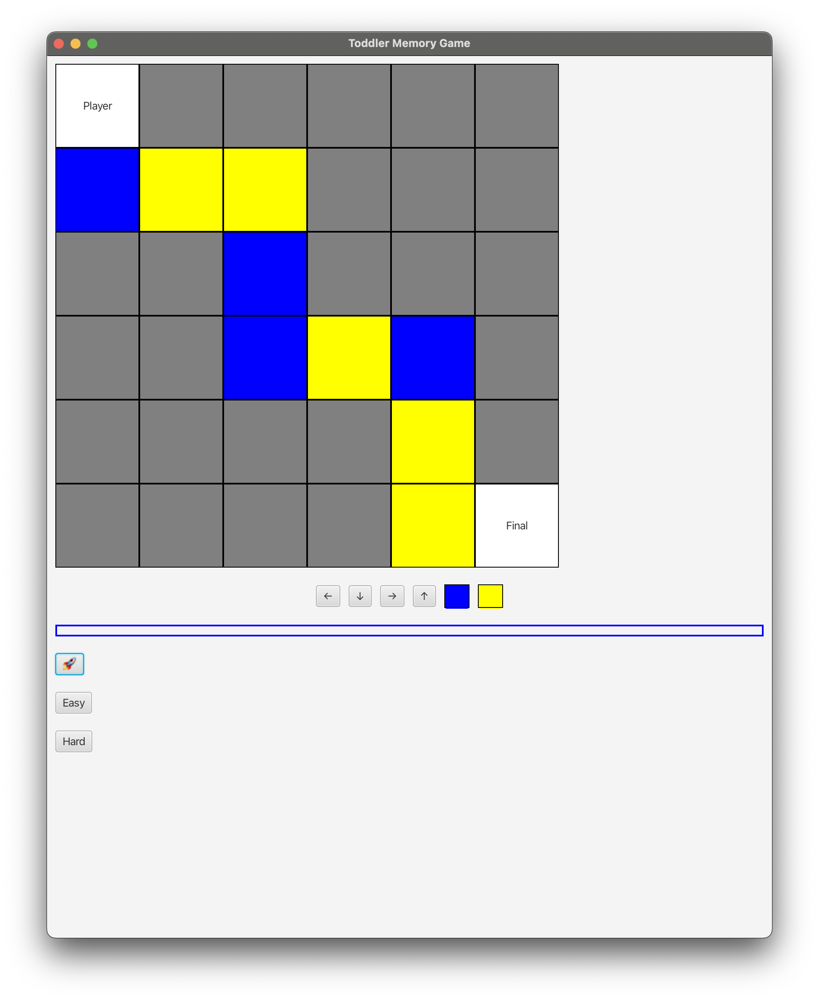
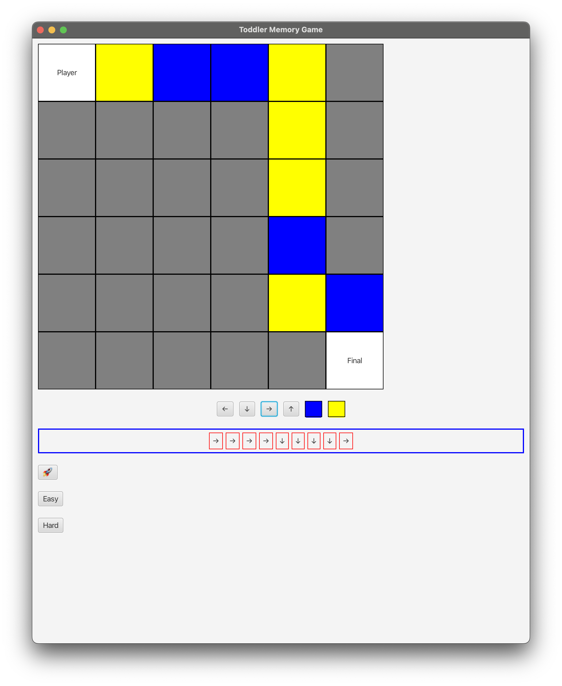
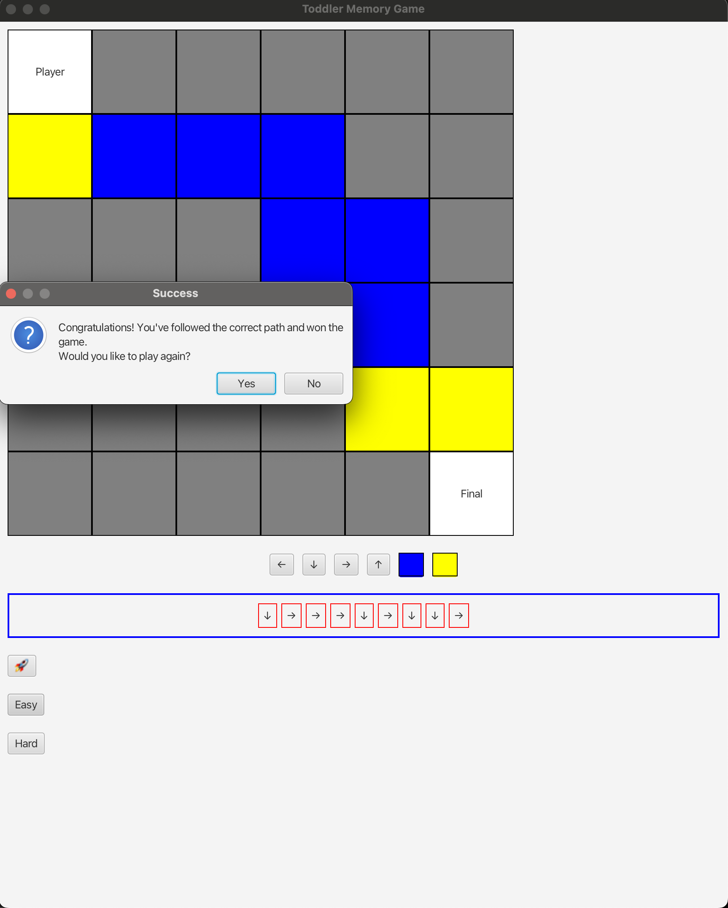
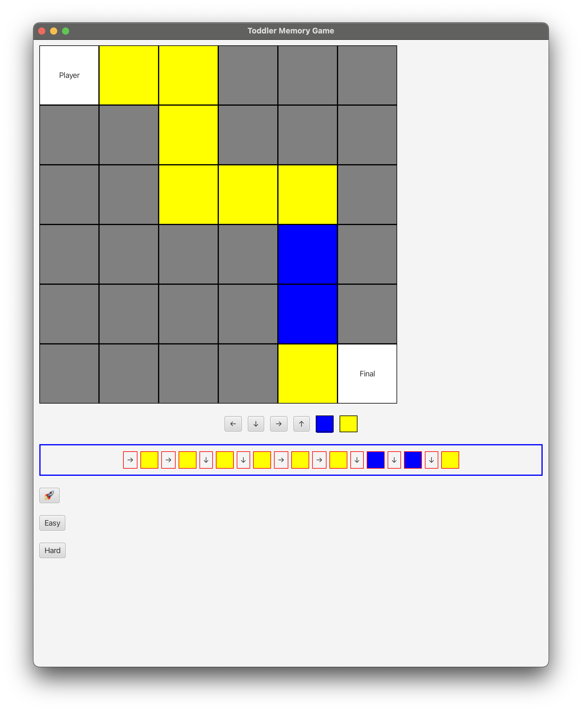
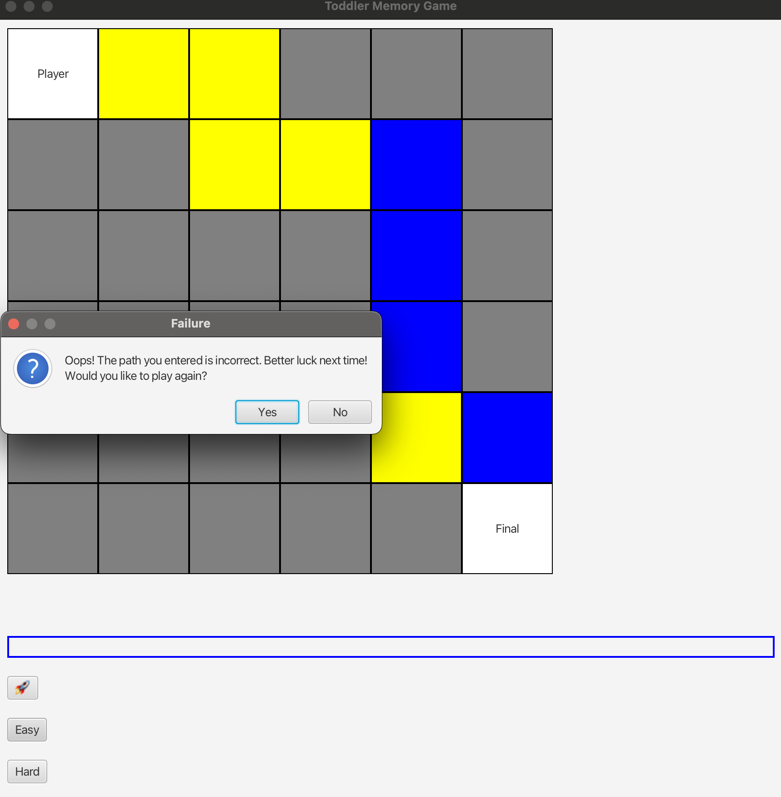

| CS-665       | Software Design & Patterns |
|--------------|----------------------------|
| Name         | Wei Wang       |
| Date         | 10/10/2024                 |
| Course       | Fall     |
| Assignment # |     Final                       |

# Assignment Overview
Please add a paragraph or two overviewing the objectives of the assignment.

- This final project showcases how to compose a couple of design patterns in one app. To elaborate, here we use the Toddler UI app as the example to demonstrate the complex logic of managing UI states and components in a well-organized fashion.

# GitHub Repository Link:
https://github.com/oliwave/cs-665-assignment-final

# Implementation Description 


For each assignment, please answer the following:

### Explain the level of flexibility in your implementation, including how new object types can be easily added or removed in the future.
  - The game is flexible enough to provide any kind of playing modes by implementing the `Mode` interface without refactoring the existing codebase
  - This highly comply with the open-closed principle
### Discuss the simplicity and understandability of your implementation, ensuring that it is easy for others to read and maintain.
  - The UI state mangement logic is completely decoupled with the UI component itself, so it's easier to maintain logic and UI separately
  - Also, state changes are captured by implementing the **Observer pattern**. That is, the connections between UI and states are weak and do not need to be aware of the exact type of objects.
### Describe how you have avoided duplicated code and why it is important.
  - The `Mode` interface enables subclasses to encapsulate specific implementations for reusability without copying the implementation to each client code that needs it
### If applicable, mention any design patterns you have used and explain why they were chosen.
  - **Observer Pattern**
    - Handy for managing UI and its state
    - For example, when `Submit` button is clicked, the `Submit` object as the `Publisher` will notify all the `Subscriber`s, such as `Player` and `Game` to reflect, without knowing their explicit types and actions they will take.
  - **Singleton Pattern**
    - `DirectionButtons` and `Submit`, etc., are singleton because we don't need a second instance of these types.
  - **Delegation Pattern**
    - The implementation of each game mode, such as `EasyMode` and `DifficultMode`, is abstracted by `Mode` interface, and then the `GameController` class as the **delegator** implementing `Mode` interface so that every *validatePath* request that comes into `GameController` is delegated to the underlying class

# Toddler App

# Prerequesite

- Use Java SDK 17 due to UI compatible with JavaFX

# Run

```
mvn clean install
mvn clean javafx:run
```

# Get Started

The application leverages JavaFX as the UI framework to develop the toddler game.

## Start Game

The game will create an auto-generated random route for you.


- Click the "🚀" button to start the game
- 

## Play Game

- Players need to follow the route until they get to the `Final`
- The game offers you two kinds of level: Easy and Hard

### Easy mode

- Players only need to follow the route by clicking the below direction buttons
  - 

- After this step, you can click **"Easy"** button to see if inputs are 100% match with the game route
  - If you pass the test, the success message is dispalyed
    - 

### Hard mode

- Players must click the direction and color buttons for each step
  - 
- After you finish, click the "Hard" button to see if you pass the test

## Restart or Finish

Players can decide to play again or exit every time the game is finished.



# Code Insights

## Folder structures

### mode
- This folder is dedicated to organize the game mode
- Each game mode has its own implementation by implementing the `Mode` interface
### path

- Responsible for managing the object structure of `Path` by favoring composition over inheritance
- `Path` has `Step`s and each `Step` has a `Direction`, `Color` and `Location`

### state

- Decouple the logic from the UI components provided by JavaFX

### view
- Controlling all the UI widgets
- To do so, we harness the power of the **Observer pattern**
- That is, whenever a UI component state is changed, other components interested in the state changes are notified and thus reflect on it
### util
- Helper classes that may not directly correlated to the game itself

# Maven Commands

We'll use Apache Maven to compile and run this project. You'll need to install Apache Maven (https://maven.apache.org/) on your system. 

Apache Maven is a build automation tool and a project management tool for Java-based projects. Maven provides a standardized way to build, package, and deploy Java applications.

Maven uses a Project Object Model (POM) file to manage the build process and its dependencies. The POM file contains information about the project, such as its dependencies, the build configuration, and the plugins used for building and packaging the project.

Maven provides a centralized repository for storing and accessing dependencies, which makes it easier to manage the dependencies of a project. It also provides a standardized way to build and deploy projects, which helps to ensure that builds are consistent and repeatable.

Maven also integrates with other development tools, such as IDEs and continuous integration systems, making it easier to use as part of a development workflow.

Maven provides a large number of plugins for various tasks, such as compiling code, running tests, generating reports, and creating JAR files. This makes it a versatile tool that can be used for many different types of Java projects.

## Compile
Type on the command line: 

```bash
mvn clean compile
```


## JUnit Tests
JUnit is a popular testing framework for Java. JUnit tests are automated tests that are written to verify that the behavior of a piece of code is as expected.

In JUnit, tests are written as methods within a test class. Each test method tests a specific aspect of the code and is annotated with the @Test annotation. JUnit provides a range of assertions that can be used to verify the behavior of the code being tested.

JUnit tests are executed automatically and the results of the tests are reported. This allows developers to quickly and easily check if their code is working as expected, and make any necessary changes to fix any issues that are found.

The use of JUnit tests is an important part of Test-Driven Development (TDD), where tests are written before the code they are testing is written. This helps to ensure that the code is written in a way that is easily testable and that all required functionality is covered by tests.

JUnit tests can be run as part of a continuous integration pipeline, where tests are automatically run every time changes are made to the code. This helps to catch any issues as soon as they are introduced, reducing the need for manual testing and making it easier to ensure that the code is always in a releasable state.

To run, use the following command:
```bash
mvn clean test
```


## Spotbugs 

SpotBugs is a static code analysis tool for Java that detects potential bugs in your code. It is an open-source tool that can be used as a standalone application or integrated into development tools such as Eclipse, IntelliJ, and Gradle.

SpotBugs performs an analysis of the bytecode generated from your Java source code and reports on any potential problems or issues that it finds. This includes things like null pointer exceptions, resource leaks, misused collections, and other common bugs.

The tool uses data flow analysis to examine the behavior of the code and detect issues that might not be immediately obvious from just reading the source code. SpotBugs is able to identify a wide range of issues and can be customized to meet the needs of your specific project.

Using SpotBugs can help to improve the quality and reliability of your code by catching potential bugs early in the development process. This can save time and effort in the long run by reducing the need for debugging and fixing issues later in the development cycle. SpotBugs can also help to ensure that your code is secure by identifying potential security vulnerabilities.

Use the following command:

```bash
mvn spotbugs:gui 
```

For more info see 
https://spotbugs.readthedocs.io/en/latest/maven.html

SpotBugs https://spotbugs.github.io/ is the spiritual successor of FindBugs.


## Checkstyle 

Checkstyle is a development tool for checking Java source code against a set of coding standards. It is an open-source tool that can be integrated into various integrated development environments (IDEs), such as Eclipse and IntelliJ, as well as build tools like Maven and Gradle.

Checkstyle performs static code analysis, which means it examines the source code without executing it, and reports on any issues or violations of the coding standards defined in its configuration. This includes issues like code style, code indentation, naming conventions, code structure, and many others.

By using Checkstyle, developers can ensure that their code adheres to a consistent style and follows best practices, making it easier for other developers to read and maintain. It can also help to identify potential issues before the code is actually run, reducing the risk of runtime errors or unexpected behavior.

Checkstyle is highly configurable and can be customized to fit the needs of your team or organization. It supports a wide range of coding standards and can be integrated with other tools, such as code coverage and automated testing tools, to create a comprehensive and automated software development process.

The following command will generate a report in HTML format that you can open in a web browser. 

```bash
mvn checkstyle:checkstyle
```

The HTML page will be found at the following location:
`target/site/checkstyle.html`


